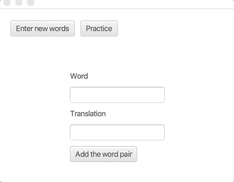

# JavaFx
Simple but interesting exercises found in the part 13 of the Java Programming course of the University of Helsinki. The objective of this section is to learn about JavaFx

# Text Statistics
As the user types text, the program gives the user information about that text (number of letters, number of words and longest word)

# Vocabulary Practice
The user can add pairs word-translation in the desired language to the dictionary and then the user can practice with the given dictionary.

# Tic-Tac-Toe
Simple tic-tac-toe game between two players

